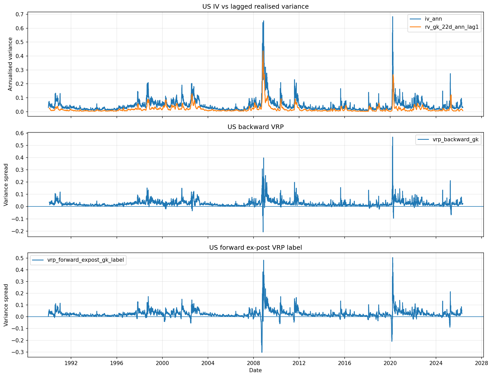
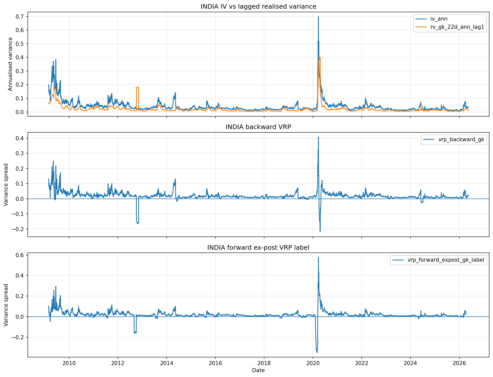
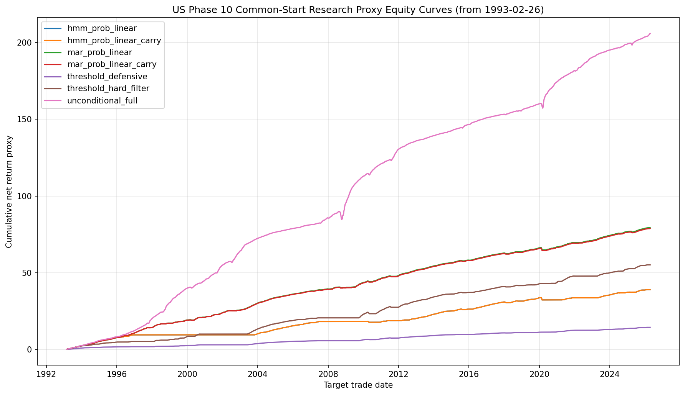
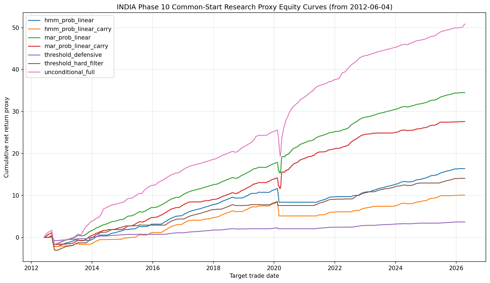
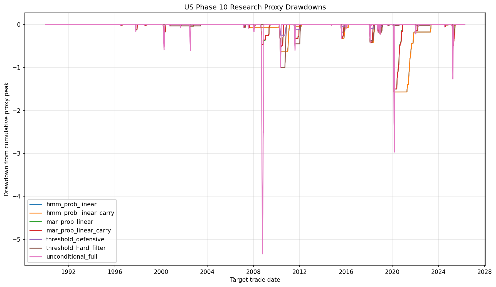
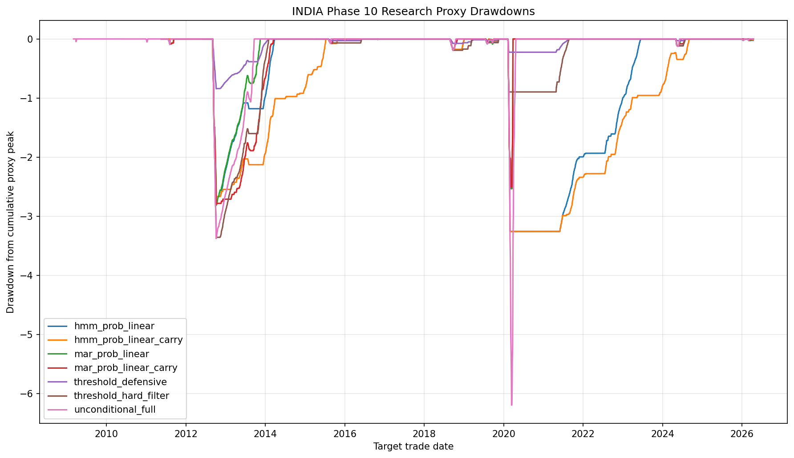
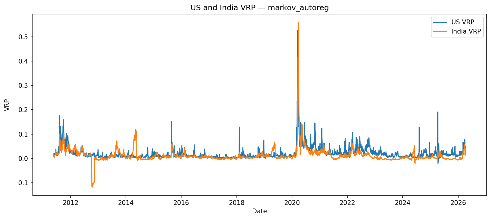
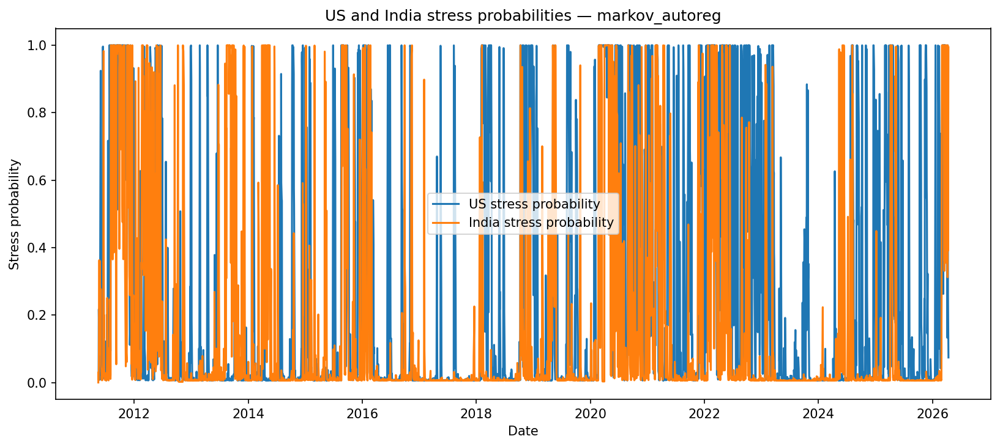
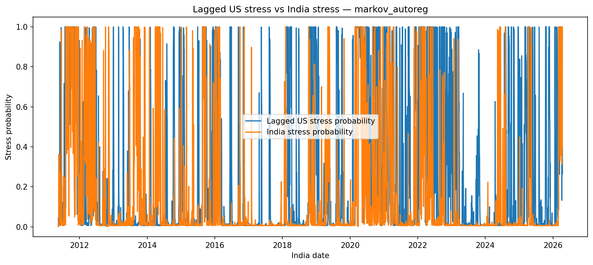

# Variance Risk Premium Decomposition and Regime-Conditional Harvesting

## A Dual-Market Empirical Study across SPX/VIX in the US and NIFTY/India VIX in India

**EPAT Final Project Report**  
**Author:** Daksh Goyal  
**Programme:** Executive Programme in Algorithmic Trading  
**Project type:** Empirical volatility research, regime modelling, and research-layer strategy evaluation  
**Report source:** `reports/final/final_report.md`  
**PDF export:** `reports/final/final_report.pdf`

---

## Report Control Statement

This report is the final Markdown source for the EPAT submission package.

The project is a public-data empirical research project. It measures and studies the variance risk premium across the US and Indian equity-index volatility markets, evaluates regime-conditioned research-proxy harvesting rules, and documents a paper-signal readiness layer.

This report does not claim live-trading profitability, true option-chain PnL, account returns, broker execution, or causal cross-market transmission. Generated data panels remain local and are not committed to GitHub.

Every major result claim in this report must be traceable to:

```text
reports/final/result_claims_audit.md
```

Every table and figure used in this report must be listed in:

```text
reports/final/table_inventory.md
reports/final/figure_inventory.md
reports/final/selected_artifacts.md
```

---

## Abstract

The variance risk premium is the empirical spread between implied variance and subsequently realised variance. In equity-index markets, implied volatility indices such as VIX and India VIX often stand above subsequent realised volatility, but unconditional short-volatility exposure can suffer severe losses during stress periods.

This project builds a reproducible dual-market research pipeline for the US and India. The US leg uses SPX/SPY and VIX. The India leg uses NIFTY 50 and India VIX. The pipeline constructs realised variance from daily OHLC data, converts implied-volatility indices into annualised implied variance proxies, builds variance risk premium features and forward outcome labels, estimates HAR-RV forecasts, fits threshold, Gaussian HMM, Markov autoregression, and MSVOL-style robustness regime models, constructs regime-conditioned exposure intentions, evaluates a vectorised research-proxy backtest, and performs cross-market US-India diagnostics.

The empirical objective is not to prove live tradability. It is to test whether regime-conditioned exposure improves research-proxy risk-adjusted behaviour relative to unconditional short-volatility harvesting, and whether US and Indian VRP regimes display useful descriptive or predictive relationships. Phase 11 adds a paper-signal readiness appendix with live-order guards, but no broker orders are placed. Phase 12 paper execution is intentionally skipped and left as future optional work.

---

## Executive Summary

This project studies whether variance risk premium harvesting can be made more defensible by conditioning exposure on volatility regimes.

The research design has three central components:

1. **VRP measurement:** estimate realised variance from daily OHLC data and compare it with implied variance proxies derived from VIX and India VIX.
2. **Regime decomposition:** classify market states using threshold regimes, Gaussian HMM, Markov autoregression, and MSVOL robustness diagnostics.
3. **Research-proxy strategy evaluation:** compare unconditional short-volatility harvesting with regime-conditioned exposure intentions in a vectorised backtest.

The project is dual-market by design. It evaluates the US and Indian markets separately, then adds a cross-market analysis layer to study same-date co-movement, lagged-US predictive diagnostics, and an analysis-only India overlay.

Main evidence categories:

| Evidence area                | Primary source                                                                                                 |
| ---------------------------- | -------------------------------------------------------------------------------------------------------------- |
| Data and VRP construction    | `reports/tables/vrp_summary.csv`; `reports/tables/vrp_metadata.json`                                           |
| HAR forecast layer           | `reports/tables/har_forecast_accuracy.csv`; `reports/tables/har_no_lookahead_audit.csv`                        |
| Regime model ladder          | Phase 5, 6, 7, and 8 diagnostic tables                                                                         |
| Strategy signal construction | `reports/tables/phase_9/strategy_signal_summary.csv`                                                           |
| Research-proxy backtest      | `reports/tables/phase_10/backtest_summary.csv`                                                                 |
| Robustness checks            | `reports/tables/phase_10/robustness_cost_sensitivity.csv`; `reports/tables/phase_10/robustness_subperiods.csv` |
| Paper-signal readiness       | `reports/tables/phase_11/live_order_guard_report.json`                                                         |
| Cross-market analysis        | `reports/tables/phase_13/logistic_model_comparison.csv`; `reports/tables/phase_13/lead_lag_table.csv`          |

Numeric findings are intentionally left as placeholders until the final local artifacts are inspected.

---

## 1. Motivation

Variance risk premium research sits between market microstructure, volatility forecasting, and systematic risk-premia design.

Equity-index options often embed a premium for protection demand, crash risk, jump risk, and volatility uncertainty. Short-volatility strategies attempt to harvest that premium, but unconditional exposure is structurally vulnerable to volatility spikes. The central motivation of this project is to evaluate whether regime conditioning can retain useful premium exposure while reducing exposure during historically adverse states.

The project is designed for EPAT as both a research and implementation exercise:

* It uses public daily data rather than private option-chain data.
* It separates research-proxy evaluation from executable trading.
* It enforces no-lookahead constraints.
* It compares two markets with different structures.
* It adds a paper-signal readiness appendix without crossing into broker execution.

---

## 2. Research Questions

The project is built around the following questions.

### RQ1 — VRP existence and construction

Can VIX and India VIX be used as implied-volatility proxies to construct a consistent public-data VRP panel for the US and Indian markets?

### RQ2 — Forecasting layer

Does a HAR-RV model provide a useful prospective realised-variance forecast layer for constructing HAR-based VRP features under point-in-time constraints?

### RQ3 — Regime decomposition

Do threshold, Gaussian HMM, and Markov autoregression models produce economically interpretable volatility or VRP regimes?

### RQ4 — Regime-conditioned harvesting

Do regime-conditioned exposure rules improve research-proxy risk-adjusted behaviour relative to unconditional short-volatility harvesting in the tested sample?

### RQ5 — Robustness

Are results sensitive to assumed transaction costs, subperiods, crisis windows, model choice, and sample alignment?

### RQ6 — Cross-market structure

Do US and Indian VRP/regime diagnostics display descriptive co-movement or lagged predictive associations, without implying causal transmission?

### RQ7 — Operational readiness

Can the final research signal be converted into a guarded paper-signal format without placing broker orders?

---

## 3. Data

### 3.1 Markets

| Market | Underlying | Implied-volatility proxy |
| ------ | ---------- | ------------------------ |
| US     | SPX / SPY  | VIX                      |
| India  | NIFTY 50   | India VIX                |

### 3.2 Data sources

The project uses public daily market data. Data loaders support official and fallback sources where possible.

Primary data categories:

| Data category            | US                        | India                     |
| ------------------------ | ------------------------- | ------------------------- |
| Underlying OHLC          | SPX/SPY daily OHLC        | NIFTY 50 daily OHLC       |
| Implied-volatility proxy | VIX                       | India VIX                 |
| Frequency                | Daily                     | Daily                     |
| Storage policy           | Local generated artifacts | Local generated artifacts |

### 3.3 Data caveats

The data layer has important limitations:

1. VIX and India VIX are implied-volatility index proxies, not variance swap quotes.
2. Daily OHLC data is not full intraday realised variance.
3. Yahoo Finance data is convenient but not official exchange data.
4. NSE scripted access may be blocked; manual CSV override is supported.
5. Generated raw and processed data panels remain local and are not committed.

### 3.4 Data coverage

Local evidence inspection found one tracked data-audit summary row and a separate calendar-alignment table. The data-audit row covers the US VIX source, while the calendar mismatch table records aligned IV/RV ranges for both markets.

Data audit summary:

| market | dataset | source | symbol | start_date | end_date | n_rows | n_missing_close |
| --- | --- | --- | --- | --- | --- | --- | --- |
| US | us_vix | fred_vixcls | VIXCLS | 1990-01-02 | 2026-05-14 | 9186.0000 | 0.0000 |

Calendar alignment summary:

| market | iv_start | iv_end | rv_start | rv_end | iv_rows | rv_rows | common_dates |
| --- | --- | --- | --- | --- | --- | --- | --- |
| US | 1990-01-02 | 2026-05-14 | 1990-01-02 | 2026-05-15 | 9186.0000 | 9160.0000 | 9156.0000 |
| INDIA | 2009-03-02 | 2026-05-15 | 2007-09-17 | 2026-05-15 | 4220.0000 | 4576.0000 | 4204.0000 |

The calendar evidence should be read conservatively: the IV and RV calendars do not have identical raw date ranges, and final feature construction uses common dates where the required inputs are available.

---

## 4. Methodology Overview

The project follows this pipeline:

```text
public daily data
  ↓
clean OHLC / VIX / India VIX series
  ↓
realised variance estimators
  ↓
implied variance construction
  ↓
variance risk premium construction
  ↓
HAR-RV forecast
  ↓
threshold regimes
  ↓
Gaussian HMM regimes
  ↓
Markov autoregression regimes
  ↓
MSVOL robustness appendix
  ↓
regime-conditioned strategy signals
  ↓
vectorised research backtest
  ↓
robustness checks
  ↓
IBKR paper-signal readiness appendix
  ↓
cross-market US-India analysis
  ↓
final report and release package
```

The design separates four layers:

| Layer                  | Purpose                                  | Output type                                |
| ---------------------- | ---------------------------------------- | ------------------------------------------ |
| Data and feature layer | Build RV, IV, VRP, HAR-VRP features      | Local panels and summary tables            |
| Regime layer           | Estimate market states                   | Regime probabilities and diagnostics       |
| Strategy layer         | Convert regimes into exposure intentions | Signal panels                              |
| Evaluation layer       | Evaluate research-proxy behaviour        | Backtest diagnostics and robustness tables |

---

## 5. Realised Variance Construction

Realised variance is estimated from daily OHLC data. The project includes multiple estimators, with Garman-Klass 22-trading-day annualised realised variance used as the primary proxy.

The inspected metadata identifies:

| Field | Value |
|---|---|
| primary_estimator | `garman_klass` |
| primary_column | `rv_gk_22d_ann` |
| rolling convention | `22` trading days |
| annualization_periods | `252` |

Candidate estimators include close-to-close, Parkinson, Garman-Klass, Rogers-Satchell, and Yang-Zhang variants. These should all be read as daily-data realised-variance proxies rather than observed variance swap outcomes.

Primary realised-variance summary:

| market | column | count | missing | mean | median | std | min | max |
| --- | --- | --- | --- | --- | --- | --- | --- | --- |
| US | rv_gk_22d_ann | 9139.0000 | 21.0000 | 0.0191 | 0.0108 | 0.0303 | 0.0013 | 0.4369 |
| INDIA | rv_gk_22d_ann | 4555.0000 | 21.0000 | 0.0299 | 0.0140 | 0.0545 | 0.0033 | 0.4845 |

Selected PDF candidate figures, not embedded in this pass:

| Figure path | Caption constraint | Status |
|---|---|---|
| `reports/figures/rv_estimators_us.png` | Daily OHLC realised-variance estimator comparison, US | optional/maybe |
| `reports/figures/rv_estimators_india.png` | Daily OHLC realised-variance estimator comparison, India | optional/maybe |

---

## 6. Implied Variance and VRP Construction

VIX and India VIX are converted into implied variance proxies by squaring the volatility index after percentage scaling.

Conceptually:

```text
implied_variance_proxy = (implied_volatility_index / 100)^2
```

The inspected VRP metadata identifies `rv_gk_22d_ann` as the primary realised-variance column, `vrp_backward_gk` as the primary backward VRP column, and `vrp_forward_expost_gk_label` as the forward ex-post outcome label. The horizon is `22` trading days, with the metadata noting that 22 trading days approximate the 30-calendar-day VIX / India VIX horizon.

Compact VRP construction summary:

| market | iv_ann_mean | iv_ann_median | rv_gk_22d_ann_lag1_mean | rv_gk_22d_ann_lag1_median | vrp_backward_gk_mean | vrp_backward_gk_median | vrp_forward_expost_gk_label_mean | vrp_forward_expost_gk_label_median |
| --- | --- | --- | --- | --- | --- | --- | --- | --- |
| INDIA | 0.0405 | 0.0281 | 0.0208 | 0.0128 | 0.0196 | 0.0145 | 0.0199 | 0.0148 |
| US | 0.0439 | 0.0310 | 0.0191 | 0.0108 | 0.0247 | 0.0184 | 0.0248 | 0.0185 |

The forward ex-post VRP label is an evaluation outcome only. It is not a tradable feature at signal time.

Selected final-report figures:





---

## 7. HAR-RV Forecasting

The HAR-RV layer estimates prospective realised variance using lagged realised-variance features. Its role is to provide a model-based expected realised variance input for prospective VRP construction.

Compact forecast comparison:

| market | forecast_col | target_col | n_obs | rmse | mae | correlation |
| --- | --- | --- | --- | --- | --- | --- |
| US | har_rv_gk_22d_forecast_ann | rv_gk_22d_forward_ann_label | 8590.0000 | 0.0247 | 0.0100 | 0.6163 |
| US | naive_lagged_22d_rv_ann | rv_gk_22d_forward_ann_label | 9112.0000 | 0.0277 | 0.0108 | 0.5829 |
| US | expanding_mean_forward_rv_baseline | rv_gk_22d_forward_ann_label | 9089.0000 | 0.0305 | 0.0141 | 0.0515 |
| US | rolling_mean_forward_rv_baseline | rv_gk_22d_forward_ann_label | 9089.0000 | 0.0311 | 0.0148 | 0.1008 |
| INDIA | har_rv_gk_22d_forecast_ann | rv_gk_22d_forward_ann_label | 3638.0000 | 0.0326 | 0.0131 | 0.1391 |
| INDIA | naive_lagged_22d_rv_ann | rv_gk_22d_forward_ann_label | 4181.0000 | 0.0384 | 0.0126 | 0.3184 |
| INDIA | expanding_mean_forward_rv_baseline | rv_gk_22d_forward_ann_label | 4137.0000 | 0.0333 | 0.0182 | 0.2406 |
| INDIA | rolling_mean_forward_rv_baseline | rv_gk_22d_forward_ann_label | 4137.0000 | 0.0332 | 0.0159 | 0.2270 |

The HAR no-lookahead audit contains `13360` rows. It records `12228` rows with `forecast_available=True`; blocked rows are labelled with observed reasons such as `insufficient_training_history, missing_target_metadata`. The audit columns include `rule_target_end_before_forecast_date`, `forecast_available`, and `blocked_reason`, supporting point-in-time availability checks.

This evidence supports HAR-RV as a model-dependent prospective RV forecast layer. It does not support guaranteed forecasting superiority.

---

## 8. Regime Modelling

The regime modelling ladder is intentionally progressive. Each layer addresses a different modelling need.

| Model layer | Purpose | Limitation |
|---|---|---|
| Threshold regimes | Simple interpretable baseline | Deterministic and threshold-sensitive |
| Gaussian HMM | Latent state classification | Does not directly model observed-series autocorrelation |
| Markov autoregression | AR-aware regime model | Reduced-form and numerically sensitive |
| MSVOL appendix | Volatility-regime robustness | Python-only MSVOL, not true R MSGARCH |

### 8.1 Threshold regimes

Threshold regimes provide a deterministic benchmark. The inspected no-lookahead audit supports `uses_strict_prior_thresholds=True` across the audited rows: `True`.

Compact threshold-regime evidence:

| market | state_name | n_days | fraction_days | avg_iv_ann | avg_vrp_har_gk |
| --- | --- | --- | --- | --- | --- |
| INDIA | calm | 29.0000 | 0.0086 | 0.0227 | 0.0070 |
| INDIA | transition | 1735.0000 | 0.5124 | 0.0209 | 0.0024 |
| INDIA | stress | 1622.0000 | 0.4790 | 0.0440 | 0.0190 |
| US | calm | 55.0000 | 0.0066 | 0.0208 | 0.0134 |
| US | transition | 3828.0000 | 0.4591 | 0.0240 | 0.0129 |
| US | stress | 4455.0000 | 0.5343 | 0.0625 | 0.0365 |

### 8.2 Gaussian HMM

The Gaussian HMM estimates latent regimes from observed features. Filtered probabilities are used where time-safe probabilities are required. Full-sample smoothed probabilities are diagnostic only.

Compact HMM state evidence:

| market | economic_state_name | n_observations | occupancy | mean_vrp_har_gk | mean_iv_ann | mean_rv_gk_22d_ann_lag1 | hmm_model_valid |
| --- | --- | --- | --- | --- | --- | --- | --- |
| US | calm | 3942.0000 | 0.4589 | 0.0093 | 0.0191 | 0.0064 | True |
| US | transition | 3391.0000 | 0.3948 | 0.0270 | 0.0444 | 0.0178 | True |
| US | stress | 1257.0000 | 0.1463 | 0.0700 | 0.1203 | 0.0648 | True |
| INDIA | calm | 2252.0000 | 0.6190 | 0.0024 | 0.0206 | 0.0093 | True |
| INDIA | transition | 1166.0000 | 0.3205 | 0.0210 | 0.0441 | 0.0207 | True |
| INDIA | stress | 220.0000 | 0.0605 | 0.0621 | 0.1164 | 0.0866 | True |

The HMM no-lookahead audits report `overall_passed=True` for both markets: US `True`, India `True`. The report therefore uses filtered-probability/no-smoothed-backtest wording.

### 8.3 Markov autoregression

Markov autoregression extends the regime ladder by allowing state-dependent autoregressive dynamics in the observed series. This addresses an important limitation of standard Gaussian HMM emissions.

Compact MAR state evidence:

| market | economic_state_name | ar_lag1_phi | sigma2 | persistence_prob | ar_stable | target_col |
| --- | --- | --- | --- | --- | --- | --- |
| US | stress | 0.9285 | 0.4259 | 0.9097 | True | vrp_har_gk |
| US | calm | 0.9587 | 0.0093 | 0.9641 | True | vrp_har_gk |
| INDIA | stress | 0.8660 | 0.3108 | 0.8103 | True | vrp_har_gk |
| INDIA | calm | 0.9970 | 0.0063 | 0.9593 | True | vrp_har_gk |

Both markets have two-state MAR summaries in the inspected files. The MAR no-lookahead audits report `passed=True`: US `True`, India `True`. MAR remains a reduced-form model and its regimes are economic interpretations, not observed ground truth.

### 8.4 MSVOL robustness appendix

The MSVOL layer is a Python-only Markov-switching volatility robustness appendix. It is not a true R MSGARCH implementation and is not used for strategy construction or backtesting.

Compact MSVOL evidence:

| market | status | n_msvol_days | n_overlap_days | diagnostic_only | used_for_strategy | used_for_backtest |
| --- | --- | --- | --- | --- | --- | --- |
| INDIA | ok | 4204.0000 | 4204.0000 | True | False | False |
| US | ok | 9155.0000 | 9155.0000 | True | False | False |

The MSVOL no-lookahead audit reports `44` passed rows out of `44` audited rows.

---

## 9. Strategy Construction

The strategy layer converts regime and carry information into next-session exposure intentions.

The strategy outputs are not broker orders. They are research-layer exposure targets used for vectorised backtesting.

Compact strategy universe:

| market | strategy_name | regime_model | available_fraction | mean_target_exposure | first_signal_observation_date | last_signal_observation_date |
| --- | --- | --- | --- | --- | --- | --- |
| US | unconditional_full | unconditional | 0.9999 | -1.0000 | 1990-01-02 | 2026-05-14 |
| US | threshold_hard_filter | threshold | 0.9107 | -0.4657 | 1990-01-02 | 2026-05-14 |
| US | threshold_defensive | threshold | 0.9107 | -0.1214 | 1990-01-02 | 2026-05-14 |
| US | hmm_prob_linear | gaussian_hmm | 0.9999 | -0.4586 | 1992-02-27 | 2026-04-14 |
| US | hmm_prob_linear_carry | gaussian_hmm | 0.9999 | -0.4583 | 1992-02-27 | 2026-04-14 |
| US | mar_prob_linear | markov_autoreg | 0.9959 | -0.6539 | 1992-02-27 | 2026-04-14 |
| US | mar_prob_linear_carry | markov_autoreg | 0.9959 | -0.6513 | 1992-02-27 | 2026-04-14 |
| INDIA | unconditional_full | unconditional | 0.9998 | -1.0000 | 2009-03-02 | 2026-05-15 |
| INDIA | threshold_hard_filter | threshold | 0.8054 | -0.5210 | 2009-03-02 | 2026-05-15 |
| INDIA | threshold_defensive | threshold | 0.8054 | -0.1367 | 2009-03-02 | 2026-05-15 |
| INDIA | hmm_prob_linear | gaussian_hmm | 0.9997 | -0.6177 | 2011-05-17 | 2026-04-13 |
| INDIA | hmm_prob_linear_carry | gaussian_hmm | 0.9997 | -0.3882 | 2011-05-17 | 2026-04-13 |
| INDIA | mar_prob_linear | markov_autoreg | 0.9959 | -0.8014 | 2011-05-17 | 2026-04-13 |
| INDIA | mar_prob_linear_carry | markov_autoreg | 0.9959 | -0.5601 | 2011-05-17 | 2026-04-13 |

The inspected table contains `7` US strategies and `7` India strategies. The signal no-lookahead audit records forward or diagnostic fields as present but excluded from strategy use where applicable; `22` audited rows have `used_by_strategy=False`.

---

## 10. Vectorised Research Backtest

The Phase 10 backtest is a vectorised research-proxy evaluation. It is not an executable option-chain simulation and does not report account returns.

The backtest evaluates proxy return units based on the project’s VRP outcome construction and exposure intentions.

Important accounting caveats:

1. Returns are research-layer proxy units.
2. Cumulative curves are additive proxy curves, not account equity curves.
3. No initial capital, margin, option contract sizing, or broker execution is modelled.
4. Transaction costs are assumptions in proxy units.
5. Overlapping 22-day labels make annualised metrics approximate.

Compact Phase 10 summary:

| market | strategy_name | n_obs | total_return_proxy | annualized_return | annualized_volatility | sharpe | sortino | max_drawdown | hit_rate |
| --- | --- | --- | --- | --- | --- | --- | --- | --- | --- |
| INDIA | hmm_prob_linear | 3638.0000 | 16.3937 | 1.1359 | 0.3207 | 3.5423 | 3.8483 | -3.2562 | 0.6692 |
| INDIA | hmm_prob_linear_carry | 3638.0000 | 10.0665 | 0.6975 | 0.3193 | 2.1843 | 2.3633 | -3.2562 | 0.4495 |
| INDIA | mar_prob_linear | 3638.0000 | 37.1641 | 2.5850 | 0.4502 | 5.7417 | 9.9048 | -2.8145 | 0.8234 |
| INDIA | mar_prob_linear_carry | 3638.0000 | 30.2355 | 2.1030 | 0.4551 | 4.6210 | 8.0640 | -2.7981 | 0.5722 |
| INDIA | threshold_defensive | 4204.0000 | 3.6845 | 0.2742 | 0.0671 | 4.0838 | 4.8435 | -0.8432 | 0.4843 |
| INDIA | threshold_hard_filter | 4204.0000 | 14.0716 | 1.0473 | 0.2604 | 4.0224 | 4.6494 | -3.3729 | 0.4843 |
| INDIA | unconditional_full | 4204.0000 | 83.3277 | 5.0212 | 0.6365 | 7.8888 | 13.3529 | -6.1924 | 0.9469 |
| US | hmm_prob_linear | 8590.0000 | 41.9781 | 1.2316 | 0.1445 | 8.5253 | 13.1863 | -1.5720 | 0.5124 |
| US | hmm_prob_linear_carry | 8590.0000 | 41.9610 | 1.2311 | 0.1445 | 8.5217 | 13.1809 | -1.5720 | 0.5122 |
| US | mar_prob_linear | 8590.0000 | 82.8569 | 2.4407 | 0.1985 | 12.2965 | 23.1696 | -1.5019 | 0.6928 |
| US | mar_prob_linear_carry | 8590.0000 | 82.2909 | 2.4240 | 0.1987 | 12.2007 | 23.0167 | -1.5019 | 0.6754 |
| US | threshold_defensive | 9156.0000 | 14.3671 | 0.4342 | 0.0450 | 9.6535 | 35.6028 | -0.2496 | 0.4475 |
| US | threshold_hard_filter | 9156.0000 | 55.1127 | 1.6657 | 0.1662 | 10.0226 | 34.1459 | -0.9984 | 0.4475 |
| US | unconditional_full | 9156.0000 | 226.4497 | 6.2476 | 0.5524 | 11.3094 | 27.8074 | -5.3365 | 0.9508 |

All metrics above are research-proxy metrics. Annualized metrics are approximate because the observations are not independent daily returns; the metadata records `annualization_periods=252` and `research_proxy_not_trade_pnl=True`.

The no-lookahead audit reports all rows passing: `True`. The Phase 10 final audit status is `passed`.

Metric-scoped comparison from `backtest_summary.csv`: by `sharpe`, the highest US row is `mar_prob_linear` at `12.2965` and the highest India row is `unconditional_full` at `7.8888`. This is a research-proxy table comparison only, not a live-trading or account-return claim.

Selected final-report figures:









---

## 11. Robustness Checks

The robustness layer tests whether Phase 10 findings are sensitive to assumptions and sample choices.

Robustness evidence availability:

| Robustness area | Evidence | Inspected status |
|---|---|---|
| Cost sensitivity | `reports/tables/phase_10/robustness_cost_sensitivity.csv` | `70` rows across cost-bps scenarios `0.0, 10.0, 2.5, 20.0, 5.0` |
| Subperiod behaviour | `reports/tables/phase_10/robustness_subperiods.csv` | `70` rows across subperiods `COVID, China_Devaluation_Vol_Shock, EuroDebt_US_Downgrade, GFC, RateShock, TaperTantrum, Volmageddon` |
| Crisis windows | `reports/tables/phase_10/crisis_window_performance.csv` | `70` rows across windows `COVID, China_Devaluation_Vol_Shock, EuroDebt_US_Downgrade, GFC, RateShock, TaperTantrum, Volmageddon` |
| Tradable proxy detection | `reports/tables/phase_10/tradable_proxy_detection.json` | status `skipped` |

The tradable proxy detection artifact reports status `skipped` with reason: required tradable proxy data not found; Phase 10 does not download new tradable proxy data.

These are sensitivity diagnostics over research-proxy assumptions. They do not prove robustness to all future execution costs, crises, or market conditions.

---

## 12. Cross-Market US-India Analysis

Phase 13 adds a cross-market analysis layer. It is analysis-only and does not alter the locked Phase 9 strategy universe.

The cross-market layer includes same-date descriptive diagnostics, lagged-US predictive/statistical diagnostics, Granger-style lead-lag diagnostics, logistic incremental-signal tests, and an analysis-only India overlay.

Alignment and no-lookahead summary:

| model | n_india_dates | n_rows | n_same_date_violations | n_same_date_or_future_us_violations | passes_no_lookahead |
| --- | --- | --- | --- | --- | --- |
| gaussian_hmm | 3638.0000 | 3638.0000 | 0.0000 | 0.0000 | True |
| markov_autoreg | 3638.0000 | 3638.0000 | 0.0000 | 0.0000 | True |

Logistic model comparison:

| model | local_n_obs | plus_us_n_obs | local_auc | plus_us_auc | delta_auc | local_pseudo_r2 | plus_us_pseudo_r2 | delta_pseudo_r2 | likelihood_ratio_p_value |
| --- | --- | --- | --- | --- | --- | --- | --- | --- | --- |
| gaussian_hmm | 3637.0000 | 3637.0000 | 0.9959 | 0.9968 | 0.0009 | 0.8975 | 0.9005 | 0.0031 | 0.2783 |
| markov_autoreg | 3637.0000 | 3637.0000 | 0.9050 | 0.9002 | -0.0048 | 0.3517 | 0.3689 | 0.0172 | 0.0000 |

India overlay summary:

| model | strategy | cutoff | n_obs | base_sharpe | overlay_sharpe | base_max_drawdown | overlay_max_drawdown | analysis_only |
| --- | --- | --- | --- | --- | --- | --- | --- | --- |
| gaussian_hmm | hmm_prob_linear_carry | 0.5000 | 514.0000 | 0.8958 | 0.7773 | -0.7231 | -0.7233 | True |
| gaussian_hmm | hmm_prob_linear_carry | 0.6000 | 514.0000 | 0.8958 | 0.7773 | -0.7231 | -0.7233 | True |
| gaussian_hmm | hmm_prob_linear_carry | 0.7000 | 514.0000 | 0.8958 | 0.7773 | -0.7231 | -0.7233 | True |
| markov_autoreg | mar_prob_linear_carry | 0.5000 | 562.0000 | 4.8201 | 3.7103 | -0.5531 | -0.5538 | True |
| markov_autoreg | mar_prob_linear_carry | 0.6000 | 562.0000 | 4.8201 | 3.9909 | -0.5531 | -0.5538 | True |
| markov_autoreg | mar_prob_linear_carry | 0.7000 | 562.0000 | 4.8201 | 4.0979 | -0.5531 | -0.5538 | True |

The Phase 13 run-status artifact reports status `ok`. Same-date diagnostics are descriptive only. Lagged-US and logistic diagnostics are predictive/statistical diagnostics only. The India overlay is analysis-only and outside the locked Phase 9 strategy universe.

Selected final-report figures:







---

## 13. IBKR Paper-Signal Readiness Appendix

Phase 11 is an operational readiness appendix. It converts research signals into guarded paper-signal artifacts and validates that live-order pathways remain blocked.

Allowed wording:

```text
paper-signal readiness layer
order-guard validation
configuration and risk-check demonstration
no broker orders placed
```

Forbidden wording:

```text
paper trading results
execution layer
live strategy
broker backtest
```

Compact guard evidence:

| artifact | field | value |
| --- | --- | --- |
| live_order_guard_report.json | passed | True |
| live_order_guard_report.json | violations | [] |
| phase11_integration_report.json | passed | True |
| phase11_integration_report.json | violations | [] |
| run_metadata.json | live_order_sent | False |
| run_metadata.json | live_orders_enabled | False |
| run_metadata.json | allow_order_placement | False |
| run_metadata.json | paper_only | True |
| run_metadata.json | kill_switch | True |
| broker_metadata.json | live_order_sent | False |
| broker_metadata.json | live_orders_enabled | False |
| broker_metadata.json | allow_order_placement | False |
| broker_metadata.json | paper_only | True |
| broker_metadata.json | kill_switch | True |
| risk_check_report.csv | data_rows | 0 |
| risk_check_report.csv | columns | valid risk-check schema |

The risk-check CSV has zero data rows but a valid risk-check schema. Broker-sensitive details are excluded from this report. The inspected guard and metadata fields support the statement that no broker orders were placed: `True`.

---

## 14. Main Findings

This section is based only on inspected local evidence listed in the Phase 14 evidence review and claim audit.

### Finding 1 - VRP construction validity

The project constructs aligned US and India VRP panels using VIX/India VIX implied-variance proxies and daily OHLC realised-variance proxies. The VRP metadata identifies `rv_gk_22d_ann` as the primary realised-variance column, `vrp_backward_gk` as the primary backward VRP column, and `vrp_forward_expost_gk_label` as an evaluation outcome label.

### Finding 2 - HAR forecast usefulness

The HAR-RV layer provides a model-dependent, point-in-time realised-variance forecast for prospective VRP construction. The forecast accuracy table contains HAR and baseline forecast rows for both markets, and the audit table records forecast availability and blocked rows by reason.

### Finding 3 - Regime interpretability

The regime ladder provides interpretable threshold, HMM, and MAR state summaries for both markets. The HMM no-lookahead audits report `overall_passed=True` for both markets, and the MAR no-lookahead audits report `passed=True` for both markets. MAR adds an AR-aware reduced-form layer beyond the Gaussian HMM.

### Finding 4 - Research-proxy strategy performance

In `backtest_summary.csv`, Phase 10 contains seven research-proxy strategy rows per market. By the metric `sharpe`, the highest US row is `mar_prob_linear` at `12.2965` and the highest India row is `unconditional_full` at `7.8888`. This comparison is metric-scoped and applies only to the vectorised research-proxy table.

### Finding 5 - Robustness and cost sensitivity

The robustness artifacts provide sensitivity diagnostics across cost-bps assumptions, named subperiods, and crisis windows. The tradable proxy detection artifact reports status `skipped`, so the report should not present Phase 10 as true instrument-level tradable proxy evidence.

### Finding 6 - Cross-market evidence

Phase 13 alignment and no-lookahead tables report zero same-date or future-US violations for the inspected models. Logistic comparison tables and overlay diagnostics are available, but they support only predictive/statistical wording and analysis-only overlay wording, not causal conclusions.

### Finding 7 - Paper-signal readiness

The Phase 11 guard artifacts report passing live-order guard and integration checks, with `live_order_sent=False` in both run and broker metadata. This supports paper-signal readiness and live-order guard wording; no broker orders were placed.

---

## 15. Terminology Lock

The report uses the following terms in a restricted way.

| Term used in report                | Meaning                                             | Not meant as                             |
| ---------------------------------- | --------------------------------------------------- | ---------------------------------------- |
| Research-proxy return              | Additive VRP proxy backtest unit                    | Account return                           |
| Exposure intention                 | Signal target from the strategy layer               | Broker order                             |
| Filtered probability               | Time-t available regime probability                 | Full-sample smoothed probability         |
| Cross-market predictive diagnostic | Statistical lead-lag or predictive association test | Causal transmission proof                |
| MSVOL robustness                   | Python Markov-switching volatility check            | True R MSGARCH                           |
| Paper-signal readiness             | Guarded signal-format and risk-check demonstration  | Broker execution or paper trading result |

---

## 16. Limitations

The full final limitations document is:

```text
reports/final/limitations.md
```

Core limitations:

1. VIX and India VIX are implied-volatility proxies, not variance swap quotes.
2. Daily OHLC realised variance estimators are proxies for true realised variance.
3. A 22-trading-day horizon approximates a one-month horizon but is not identical to 30 calendar days.
4. Forward ex-post VRP labels are outcomes only, not tradable features.
5. HAR forecasts are model-dependent and constrained by training-window choices.
6. Gaussian HMM does not directly model observed-series autocorrelation.
7. Markov autoregression addresses observed-series autocorrelation but remains reduced-form.
8. MSVOL is Python-only volatility-regime robustness, not true R MSGARCH.
9. Strategy outputs are exposure intentions, not broker orders.
10. Phase 10 returns are research-layer proxy units, not account returns.
11. Overlapping 22-day outcome labels make annualised metrics approximate.
12. Phase 11 did not place broker orders.
13. Phase 12 paper execution was skipped and remains future optional work.
14. Phase 13 diagnostics are statistical/predictive diagnostics, not causal proof.
15. Generated panels remain local and are not committed to GitHub.

---

## 17. Future Work

The full future work document is:

```text
reports/final/future_work.md
```

Future extensions:

1. True option-chain PnL using historical option chains.
2. Instrument-level execution modelling with bid/ask spreads, liquidity, margin, and contract selection.
3. Optional IBKR paper execution adapter.
4. True R MSGARCH implementation.
5. Intraday realised variance using high-frequency data.
6. Broader international volatility-index comparison.
7. Production-grade monitoring and deployment safeguards.

These are explicitly outside the current EPAT submission scope.

---

## 18. Reproducibility

The full reproducibility documentation is:

```text
docs/reproducibility.md
reports/final/reproducibility_note.md
docs/commands.md
```

A reviewer can inspect the tracked repository without receiving large local data files. The reproducible tracked layer includes:

```text
source code
configs
scripts
tests
docs
README files
environment template
directory placeholders
final report package
```

Local-only generated artifacts include:

```text
raw market data
processed feature panels
trained model outputs
regime panels
strategy signal panels
backtest panels
broker/paper-signal cache
cross-market panels
```

Minimal validation commands:

```bash
pip install -e .
pytest
python scripts/download_data.py --dry-run
```

Final release validation commands are documented in:

```text
docs/release_checklist.md
docs/commands.md
```

---

## 19. Appendix A — Report Artifact Map

| Report area        | Evidence inventory                     |
| ------------------ | -------------------------------------- |
| Claims audit       | `reports/final/result_claims_audit.md` |
| Table inventory    | `reports/final/table_inventory.md`     |
| Figure inventory   | `reports/final/figure_inventory.md`    |
| Selected artifacts | `reports/final/selected_artifacts.md`  |
| Release checklist  | `docs/release_checklist.md`            |
| Submission map     | `docs/submission_package.md`           |

---

## 20. Appendix B — Required Final Validation

Before freezing Phase 14, run:

```bash
git diff --check
git status --short
git ls-files | findstr /i "\.parquet \.pkl \.pickle \.joblib \.pt \.pth \.log \.env"
git ls-files | findstr /i "broker_cache data/raw data/interim data/processed"
pytest
python scripts/validate_phase11.py --print-json
python scripts/run_cross_market_analysis.py --validate-inputs-only
pytest tests/test_cross_market_alignment.py tests/test_cross_market_no_lookahead.py tests/test_cross_market_stats.py tests/test_cross_market_overlay.py tests/test_phase13_artifact_mutation.py tests/test_phase13_datetime_dtype.py
```

Expected policy result:

```text
No heavy generated artifacts tracked.
No credentials tracked.
No broker-sensitive artifacts tracked.
No live-order evidence.
No unaudited numeric report claims.
```

---

## 21. Appendix C — Final Report Completion Checklist

Before PDF export:

* [ ] All numeric placeholders resolved or explicitly left as placeholders.
* [ ] Every major claim appears in `result_claims_audit.md`.
* [ ] Every table appears in `table_inventory.md`.
* [ ] Every figure appears in `figure_inventory.md`.
* [ ] All figures have research-proxy or diagnostic captions.
* [ ] No account-return wording.
* [ ] No live-trading profitability wording.
* [ ] No true option-chain PnL wording.
* [ ] No causal cross-market wording.
* [ ] No true MSGARCH wording.
* [ ] Phase 11 is appendix-only.
* [ ] Phase 12 is skipped / future optional.
* [ ] Limitations are complete.
* [ ] Future work is complete.
* [ ] Reproducibility note is complete.
* [ ] PDF visually inspected after export.
